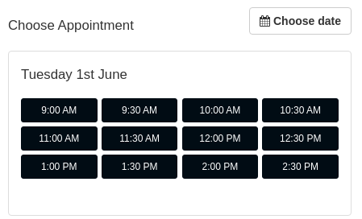

Appointment Scheduling Component
===

### Outline of Work

Create a User Interface to allow booking appointments online. 

- No backend required, just use mock JSON data
- Allow customer to select one or more services
- Allow customer to See available dates & times
- Allow customer to choose specific staff member (optional)
- Make a component that implements the functionality that could be used anywhere (dedicated page, in a popup, embedded in iframe, etc)

### Goals

- Develop User Experience for Booking a Service
- Display availablility for date & times based on duration of services selected.
- Record Booking Data as JSON object consistent with [booking.json](./booking.json)

### Technology Requirements
- Written in Vue 2.x
- Prefer Composition API
- Prefer Typescript
- Do not use a router

### Mock Data Defenition
#### Services Record [services.json](./services.json)
- `id` Identifier
- `category` Category name
- `name` Name of service
- `staff` Staff who can do this service
- `time` Time in minutes for appointment
- `preptime` Time in minutes required before appointment
- `posttime` Time in minutes required after appointment

#### Staff Record [staff.json](./staff.json)
- `id` Identifier
- `name` Staff Name
- `schedule` List of times staff is available

#### Booking Record [booking.json](./booking.json)
- `id` Identifier
- `customer` Customer ID
- `date` Date of Booking
- `start` Start time
- `end` End time
- `staff` Staff identifier
- `type` Appointment type identifier

#### Customer Record [customer.json](./customer.json)
- `id` Identifier
- `name` Customer Name
- `email` Customer Email Address

### Customer Experience
#### Step 1
- Login button for returning Users (Show Login Modal)
- Register button for new users (Show register Modal)
- (action) Select a Service Category which goes to step 2b
- (action) Select a Staff member which goes to Step 2a

Example UI:

#### Step 2a
- Login button for returning Users (Show Login Modal)
- Register button for new users (Show register Modal)
- Back button to return to Step 1
- (action) Select Staff member => Goes to Step 2b (only show appoints types for staff selected)

#### Step 2b
- Login button for returning Users (Show Login Modal)
- Register button for new users (Show register Modal)
- Back button to return to Step 1
- Show list of appointment types in selected category

### Step 3
- Login button for returning Users (Show Login Modal)
- Register button for new users (Show register Modal)
- Back button to return to Step 2
- Show user list of dates for appointment booking (Only show dates with availability)

Example UI:

### Step 4
- Login button for returning Users (Show Login Modal)
- Register button for new users (Show register Modal)
- Back button to return to Step 3
- Show user list of times for appointment bookings (Only show available times in 15 minutes blocks)

Example UI:

### Step 5
- Show booking information
- (action) Add service
- (action) Confirm Booking (Require Name, Email & Phone if not logged in)

### Step 6
- Booking Details displayed
- If not logged in, offer to create account
- Button to add to Google Calendar
- Button down download Appointment as iCal file

Example UI:

